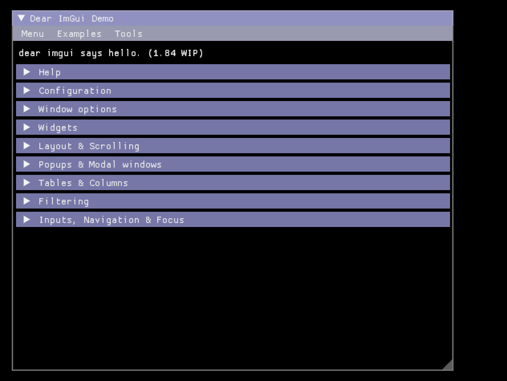
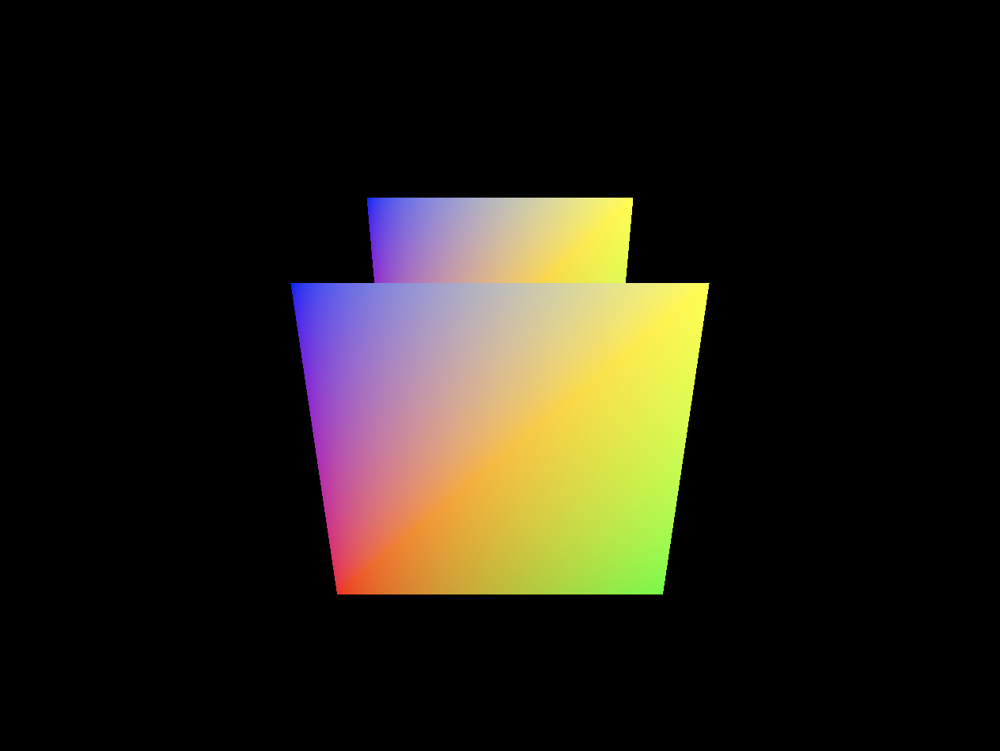
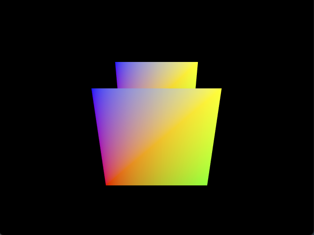
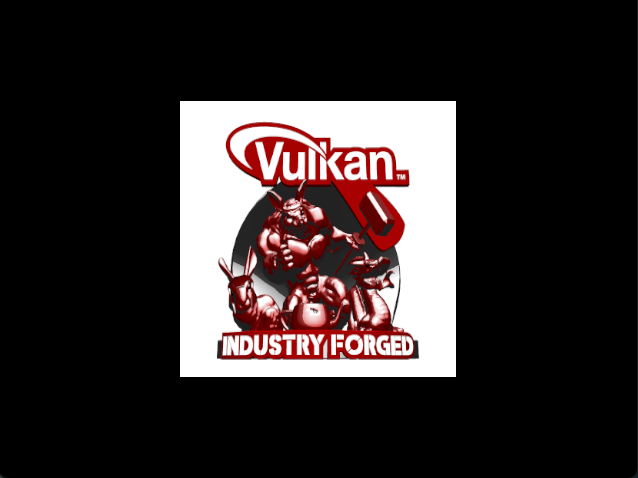
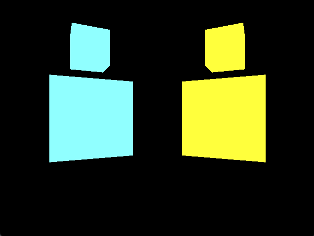
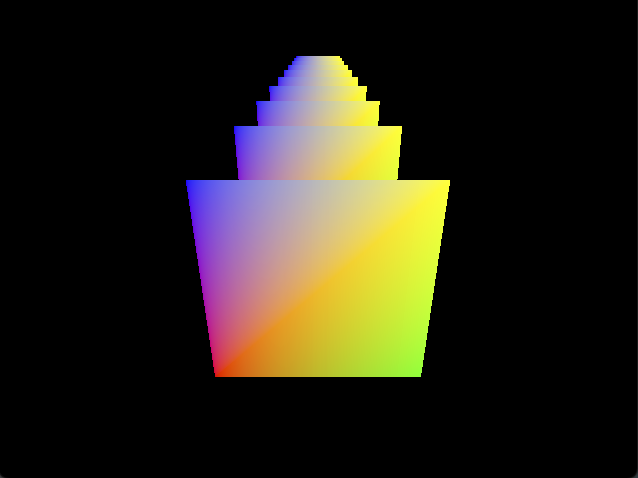
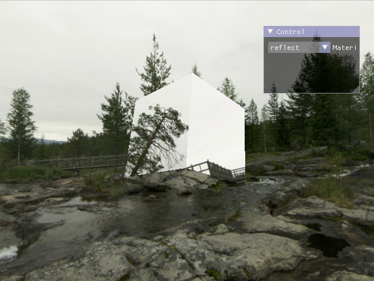

Slim Engine
===========
**Slim Engine** is a vulkan-based rendering engine for educational purpose.

Architecture
------------

* Render Graph
    - Reference: [FrameGraph: Extensible Rendering Architecture in Frostbite](https://www.gdcvault.com/play/1024612/FrameGraph-Extensible-Rendering-Architecture-in)
    - **Slim Engine** implements a simplified FrameGraph. It benefits from the main concept of FrameGraph, and implements a functional, code driven framework for organizing resources and render pass dependencies within a frame.
    - Things I have implemented
        - virtual resources and passes creation
        - actual resource allocation and deallocation based on reference counting
        - automatic resource layout transition (attachments are transitioned by render passes already by Vulkan, textures layouts are transitioned by RenderGraph)
        - async compute, which is a must-have feature if we are going for complete GPU driven pipeline (however, I have not validated the correctness of this feature)
        - multi-subpass render passes support for tile-based architecture. Subpass dependencies are automatically calculated, and only tested in simple examples.

* Material System
    - **Slim Engine** implements an experimental material system based on an industrial design - Render Queue.
    - The idea was directly taken from [Unity](https://docs.unity3d.com/ScriptReference/Rendering.RenderQueue.html), but the details are not.
    - The material system consists of multiple components:
        * graphics pipeline
        * technique
        * material
    - A technique contains multiple graphics pipelines, with each pipeline assigned a render queue value.
    - A material operates on top of a technique, and also manages descriptor resources.
    - This material system could be integrated with the scene graph.

* Scene Graph
    - **Slim Engine** implements a primitive scene graph, which consists of
        * node
        * mesh
        * material
    - Nodes makes up the hierarchy of the scene graph.
    - A node could contain multiple pairs of mesh and materials, or it could also be simply for transform hierarchy.
    - **Slim Engine** provides a scene builder for managing the ownership of all nodes, meshes and materials used in the scene.
    - The same scene builder also provides supports for building bottom-level acceleration structure (BLAS) and top-level accleration structure (TLAS), used in Ray Tracing.
    - Things I have not implemented:
        - The current scene graph is only a tree, not a real graph, need to extend the design to support a node being added multiple times.
        - I have not implemented any support for instancing. Currently the instancing requires user code manually.

Examples
--------
During development, I have written progressively written some simple examples
demonstrating how to use this library.

Examples are located in `Examples/` directory. Here's a list of the examples.

* Buffer Copy
    - This is an example for data copying between buffers.

* Compute
    - This is an example launching a simple compute kernel, with input/output buffers.

* Dear ImGui
    - This is an example showcasing integration of a well-known immediate mode GUI library (Dear ImGui).
	- .

* Depth Buffering
    - This is an example showcasing how to enable depth testing with with depth/stencil attachment.
	- 

* Multisampling
    - This is an example showcasing how to enable multisampling with resolve attachment.
	- 

* Texture Mapping
    - This is an example showcasing how to load and setup 2D texture for rendering.
	- 

* Render to Texture
    - This is an example showcasing how to do render to texture with multipass frame graph.
	- 

* Scene Graph
    - This is an example showcasing how to use hierarchical scene graph for scene management.
	- 

* Geometries
    - This is an example showcasing how to use slim's geometry data generation API.
	- 

* Descriptor Indexing
    - This is an example showcasing how to use descriptor indexing feature provided by vulkan.
    - This is a feature used heavily for GPU-driven pipeline.
	- 

* Skybox
    - This is an example showcasing how to setup a skybox, and implement reflect/refract materials.
	- 

* Deferred Rendering
    - This is an example showcasing how to use Vulkan's multi-subpass render passes.
    - A simple and unoptimized implementation for deferred rendering is provided as a demo.
	- 

* MatCap
    - This is a simple demo for MatCap. MatCap is a great technique for extremely cheap cost. However, the lighting must be static because the lighting is baked into the MatCap texture.
    - Details from: [MatCap](https://github.com/nidorx/matcaps)
	- 

* Ray Tracing
    - This is an example for basic ray tracing setup, showcasing how to use slim's raytracing builder.
	- 

Applications
------------

* GLTFViewer
    - Implement a basic gltfviewer, with physically-based rendering (PBR) shaders.

Dependencies
------------

* Vulkan
* VulkanMemoryAllocator
* glm
* stb
* tinygltf
* imgui (DearImGui)
* imnodes

Author(s)
---------
Tianyu Cheng

[tianyu.cheng@uteaxs.edu](mailto:tianyu.cheng@uteaxs.edu)
